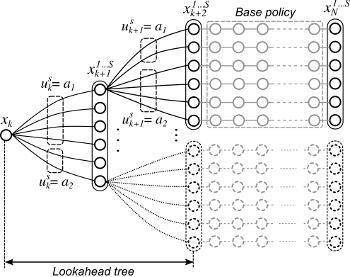
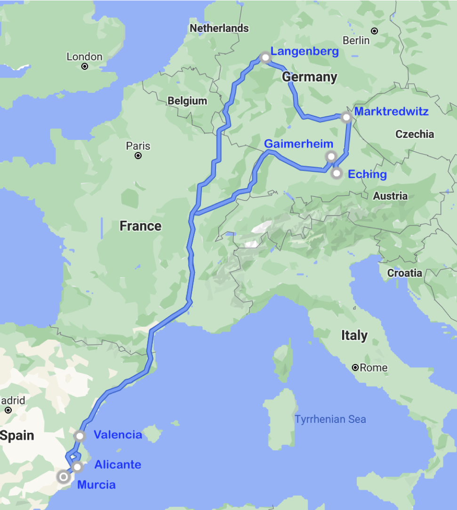
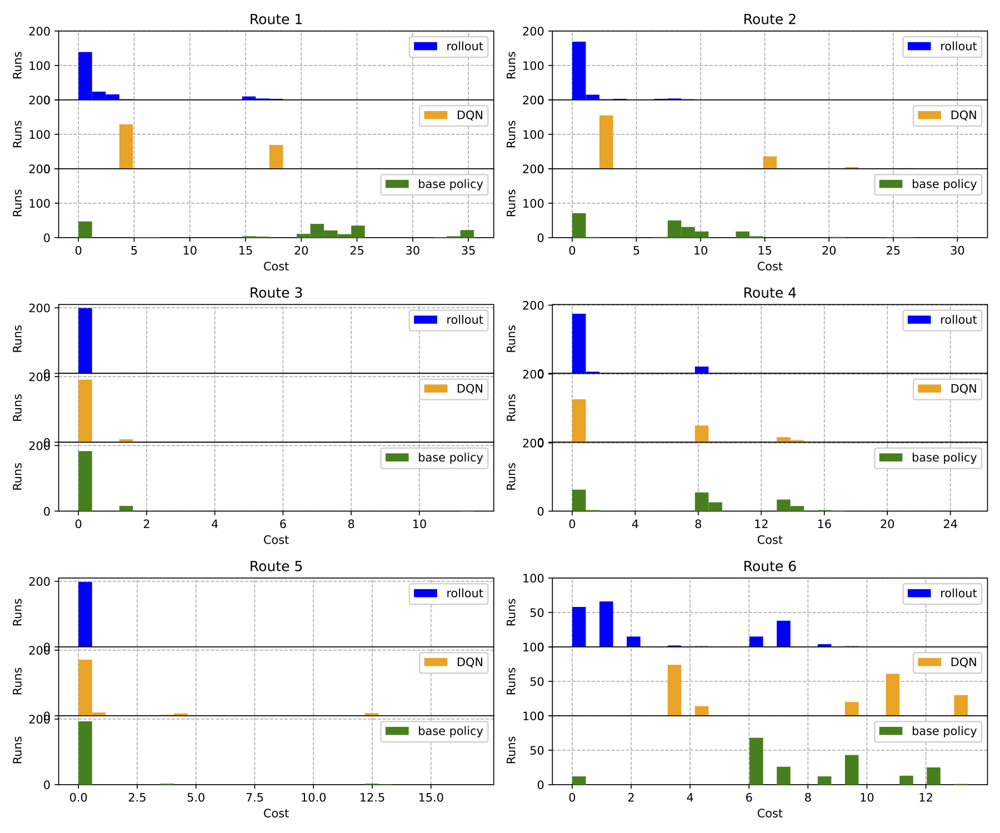

# Model-based RL for route timing decisions

## Description

Source code of the paper "[Online Model-Based Reinforcement Learning for Decision-Making in Long Distance Routes](paper/manuscript.pdf)" accepted for publication on Elsevier's Transportation Research Part E. The code includes a simulator environment that generates the successive stages in a long-distance transport route with time windows. At each stage, a decision regarding driving and rest periods must be made within the options allowed by the European driving regulations (EC Regulation 561/2006): e.g. take a full break, take a split break, make a split rest, extend daily driving time, reduce daily rest time, etc. The goal is to arrive at each customer within its delivery time window while complying with European regulations on driving hours and rest periods.



To make these en-route decisions we propose a novel model-based reinforcemnt learning strategy combining model predictive control, rollout, and Monte Carlo tree search. A DQN agent is also provided for comparison.



## Acknowledgements

This work was supported by Consejeria de Desarrollo Economico, Turismo y Empleo, Region de Murcia, under the RIS3Mur project grant SiSPERT (ref. 2I16SAE00023) and by Grant PID2020-116329GB-C22 funded by MCIN / AEI / 10.13039/501100011033  


## How to use it

### Requirements

The environment and the rollout agent have been tested in Python 3.5 and 3.6. No specific instalation instructions are required. The only required package is:

scipy==1.5.4

To generate and represent the performance results the following packages are required

numpy==1.19.1  
matplotlib==3.3.4  

To run the DQN agent, Keras is required. The tested version is:
Keras==2.2.1

### Experiment scripts

There are 2 scripts for launching simulation experiments:

- experiments_RL.py: runs the experiments with the proposed rollout agent and the baseline policy
- experiments_DQN.py: runs the experiments with the DDQN agent

The experiments run on 6 specific routes using predefined parameter configuration. Other routes and configurations can be tested by modifiying the scripts. 200 simulation runs per route are executed. 

And a jupyter notebook for plotting results:  

- RL_results.ipynb: plots the histograms comparing the results of each agent (rollout, baseline, DQN) in the 200 simulation runs of each route (figure 4 of the paper).

  


## Project structure

The environment is implemented in:  

- route_environment.py

A modified version for DQN is provided

- route_environment_DQN.py

The following files provide auxiliary methods:

- serialize.py  
- switch_function.py

The rollout agent is implemented in 
- rollout_agent.py  

The DQN agent is implemented in

- ddqn_keras.py  

The ```routes``` directory contains the data files with the description of each route. These routes are based on real-life examples. The ```results``` store the results of the simulation experiments.

## How to cite this work

The code of this repository:

@misc{mbrl_decisions,  
    title={Model-based RL for route timing decisions},
    author={Juan J. Alcaraz},  
    howpublished = {\url{https://github.com/jjalcaraz-upct/mbrl-route/}},  
    year={2022}  
}

The paper where the rollout algorithm was presented:

@misc{alcaraz2022,
  author = {Alcaraz, Juan J. and Losilla, F. and Caballero-Arnaldos, Luis},  
  title = {Online Model-Based Reinforcement Learning for Decision-Making in Long Distance Routes},  
  year = {2022},  
  publisher = {Elsevier},  
  journal = {Transportation Research part E},  
  note = {accepted for publication},  
}

## Licensing information

This code is released under the MIT lisence.
